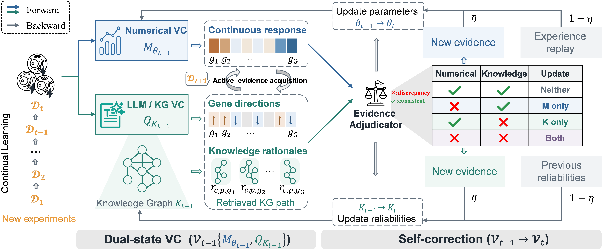

<div align="center">

# VCrectify

**Evidence-adjudicated continual learning for virtual cells**


</div>



VCrectify couples a numerical virtual cell with a knowledge-based reasoner. Both predict before a perturbation outcome is revealed. An adjudicator then corrects the numerical model, the evidence reliabilities, both, or neither. Updated states jointly select the next experiment.

The framework is independent of the backbone. This release includes an adapter to the **official TxPert implementation**, an independently implemented **SUMMER adaptation**, and small, explicitly named reference models for testing. The biological example uses **Replogle K562 essential-gene Perturb-seq**.

> The service configuration uses **Qwen3-8B**, with the URL intentionally blank. A live SUMMER experiment requires a configured endpoint.
> 
## Quick start

Python 3.9+; the standalone framework demo needs neither GPU nor model service.

```bash
cd VCrectify
python -m pip install -e ".[test]"
python -m vcrectify demo --output runs/demo
python -m pytest -q
```

The demo is synthetic and checks the software contract. It writes a sealed acquisition log, predictions, metrics and a resumable checkpoint. Use a new output directory for a new experiment; an existing audit log is never silently overwritten.

### Replogle K562

Download the original K562 essential-gene H5AD from the [Replogle data deposit](https://doi.org/10.25452/figshare.plus.20029387), subject to its terms, and set `prepare.source` in the preparation config.

```bash
python -m vcrectify prepare --config configs/prepare_k562_smoke.yaml
python -m vcrectify run --config configs/k562_reference.yaml
```

The reference run uses genuine cells with diagnostic models. It provides an inexpensive check of data preparation and the continual loop. The smoke split has 64 readout genes and 24 perturbation conditions; it is not the full benchmark. See [data provenance and preprocessing](docs/data.md).

### TxPert + SUMMER / Qwen3-8B

1. Set up the [official TxPert adapter](docs/backbones/txpert.md), its graph and optional dependencies.
2. Import the [official SUMMER summaries and graph](docs/backbones/summer.md); preserve their source and license metadata.
3. Set the model service configuration. The key is read only from an environment variable.

```powershell
$env:VCRECTIFY_LLM_BASE_URL = "https://YOUR-SERVICE/v1"
$env:VCRECTIFY_LLM_MODEL = "Qwen3-8B"  # exact model identifier exposed by your service
$env:VCRECTIFY_API_KEY = "YOUR-KEY"
python -m vcrectify doctor --config configs/k562_txpert_summer.yaml
python -m vcrectify run --config configs/k562_txpert_summer.yaml
```

`doctor` runs offline and reports missing resources, summary coverage and an upper bound on LLM calls. The loop uses exact leave-one-perturbation-out calibration, which can be expensive. Model settings and cache identity are explicit. There is no automatic fallback to a reference model when a service is unavailable.

For numerical-only integration validation, `configs/k562_txpert_smoke.yaml` combines real TxPert with the explicitly named reference memory reasoner.

## What is implemented

| Component | Behavior |
|---|---|
| Initialization | Train the numerical state on initial conditions; calibrate cited evidence reliabilities with the manuscript's unit prior |
| Thresholds | Exact LOPO on the initial set; separate fixed 90th percentiles |
| Acquisition | Half highest cross-state disagreement, half uniform exploration; active by default |
| Adjudication | Separate numerical RMSE and response-weighted categorical errors; strict threshold comparison |
| Numerical correction | Condition-averaged new-evidence/replay losses, weighted by the shared adaptation coefficient |
| Knowledge correction | EMA agreement update for the evidence IDs cited before outcomes were revealed; fixed LLM |
| Replay | Condition-level reservoir; every revealed condition admitted after correction |
| Ablations | Update-all and count-matched random correction; each variant acquires online from its own state |
| Audit and recovery | Hash-linked JSONL events; NumPy/JSON checkpoints, model and RNG states, strict provenance checks |

The observed case memory admits all revealed conditions after correction, including `NoUpdate`. This explicit convention lets later reasoning use observed experiments without changing evidence reliabilities when the gate is closed. External knowledge acquisition is an optional manuscript extension and is not enabled in this release.

## Bring your own backbone

Implement the small [numerical and reasoning protocols](src/vcrectify/types.py). Register a Python factory directly in YAML:

```yaml
numerical:
  name: your_package.adapters:make_numerical
reasoning:
  name: your_package.adapters:make_reasoner
```

The engine supplies conditions during inference and revealed observations during correction. Neither adapter receives an outcome oracle. Read [the adapter contract](docs/backbones.md) for alignment, state persistence, native-loss and leakage requirements.

## Inspect an experiment

```text
runs/<experiment>/
├── run_manifest.json          # dataset fingerprint, settings, provenance
├── events.jsonl               # sealed predictions → reveal → correction
├── checkpoint.npz             # model, optimizer, memory, reservoir and RNG state
├── heldout_predictions.json   # last held-out predictions with evidence citations
├── metrics.json               # held-out trajectory
└── summary.json               # completion and timing
```

```bash
python -m vcrectify run --config configs/k562_reference.yaml --max-rounds 1
python -m vcrectify run --config configs/k562_reference.yaml --resume
```

Run these two commands in a fresh output directory. Resume works at completed round boundaries. If interruption leaves an audit log ahead of its checkpoint, the runner stops rather than replaying an ambiguous partially completed update. See [method and operational details](docs/method.md).

Run an online ablation using a separate output directory:

```bash
python -m vcrectify run --config configs/k562_txpert_smoke.yaml --correction update_all --output runs/txpert_update_all
python -m vcrectify run --config configs/k562_txpert_smoke.yaml --correction random_matched --output runs/txpert_random_correction
```

Each run independently recalibrates and acquires from its own state. Set `--acquisition random` for the acquisition-policy ablation.

## Research use and licensing

VCrectify's independently written framework is under [Apache-2.0](LICENSE). **TxPert code and SUMMER's official assets have separate, restrictive terms.** They are not covered by the framework license and are excluded from source distributions. Read [third-party notices](THIRD_PARTY_NOTICES.md) before using or distributing them.

The release does not bundle patient-level data, model weights, credentials, upstream restricted code or claimed benchmark results. Software citation metadata is provided in [CITATION.cff](CITATION.cff); the authors will add the manuscript's final title, author list and publication identifier when available.

Contributions: [CONTRIBUTING.md](CONTRIBUTING.md) · Reproducibility: [docs/validation.md](docs/validation.md)
