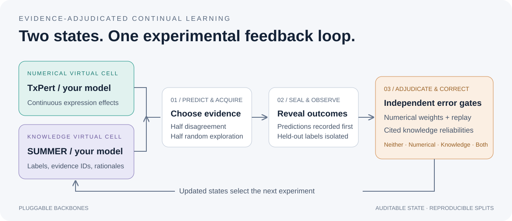

# VCrectify：证据裁决驱动的虚拟细胞持续学习框架

框架将数值 VC、知识推理 VC、主动获取、裁决与持续修正分开实现，可以替换 backbone。示例接入官方 **TxPert** 架构，以及基于 **Qwen3-8B** 服务的 **SUMMER 方法适配器**，使用真实 Replogle K562 essential-gene 数据。



## 快速运行

```bash
git clone https://github.com/wangxiaotang0906/VCrectify.git
cd VCrectify
python -m pip install -e ".[test]"
python -m vcrectify demo --output runs/demo
python -m pytest -q
```

`demo` 是合成数据上的工程检查。真实 K562 流程：

```bash
python -m vcrectify prepare --config configs/prepare_k562_smoke.yaml
python -m vcrectify run --config configs/k562_reference.yaml
python -m vcrectify run --config configs/k562_txpert_smoke.yaml
```

第二条使用明确命名的诊断模型，第三条使用真实 TxPert 与诊断推理器。两者都不代表完整 TxPert + SUMMER 的论文结果。TxPert 依赖和图数据配置见[适配文档](docs/backbones/txpert.md)。

## 接入 SUMMER 服务

按你的要求，服务地址保留为空，模型默认 `Qwen3-8B`。填写服务实际暴露的模型名；密钥通过环境变量设置。

```powershell
$env:VCRECTIFY_LLM_BASE_URL = "https://YOUR-SERVICE/v1"
$env:VCRECTIFY_LLM_MODEL = "Qwen3-8B"
$env:VCRECTIFY_API_KEY = "YOUR-KEY"
python -m vcrectify doctor --config configs/k562_txpert_summer.yaml
python -m vcrectify run --config configs/k562_txpert_summer.yaml
```

使用前按 [SUMMER 文档](docs/backbones/summer.md)准备带来源标识的知识摘要及图。没有地址时程序会明确报缺失配置，不会自动替换成假推理或下载其他模型。`doctor` 不调用服务，并估算 LLM 调用上限。

## 与论文保持一致的约定

- 主动获取默认开启：一半高分歧、一半随机探索；消融变体各自在线选样。
- 阈值只用初始训练集做严格 LOPO 校准，持续学习中固定。
- 同批预测与引用先封存，再揭示标签、裁决和更新。
- replay 按扰动条件做 reservoir sampling；新证据与 replay 分别按条件平均后加权。
- 所有已观察实验在更新后进入案例记忆，包括 `NoUpdate`；关闭知识修正时不更新摘要权重。
- 测试集只做评估；评估不影响用于后续选样的随机状态。

每次运行保存数据指纹、配置、事件记录、指标、预测与可恢复的状态。续跑需同一配置，并在已完成轮次的检查点恢复。完整方法、指标和边界见[方法说明](docs/method.md)、[评估说明](docs/evaluation.md)与[实测验收记录](docs/validation.md)。

当前 64 基因、24 条件的配置用于集成验收，不能与论文全量表格直接比较。正式实验还需冻结完整数据划分、图版本和验证集选出的超参数。

框架独立代码采用 Apache-2.0；TxPert 和 SUMMER 官方资源有单独的非商业等限制，不能随框架许可证一起授权。详见[第三方声明](THIRD_PARTY_NOTICES.md)。
